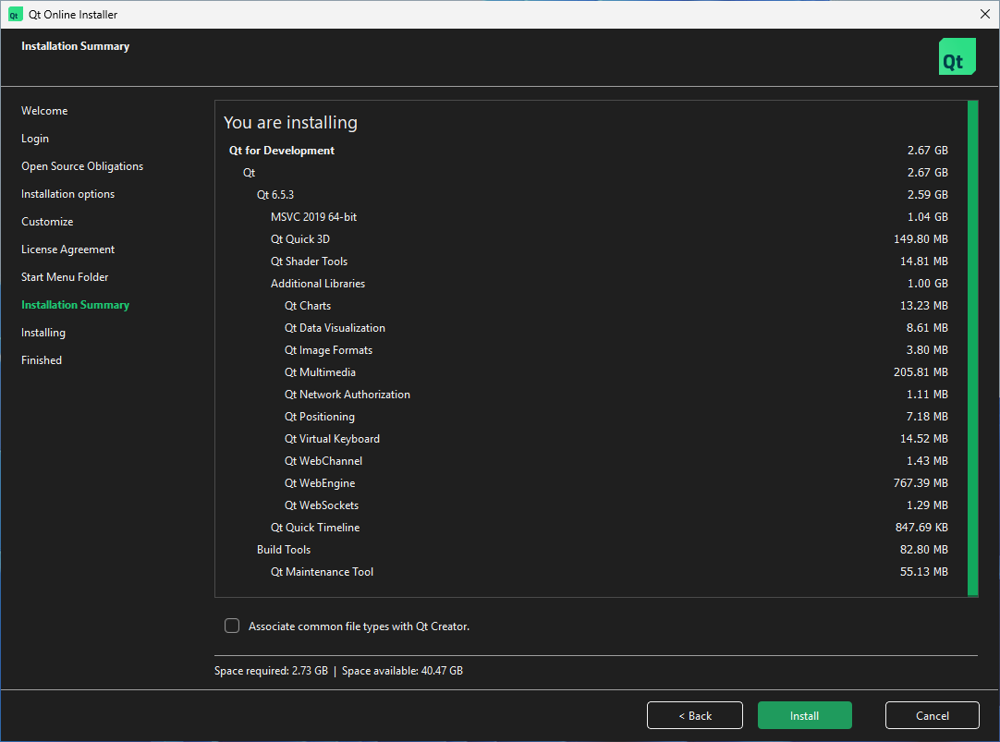

# Qt preparation container

The first container is a temporary Windows environment used only to obtain and install Qt.

Qt is not installed automatically by the OpenRV Docker build because the Qt Open Source installer requires direct user interaction, including a Qt account or email login and acceptance of Qt’s applicable license terms.

The user launches the temporary Windows container, connects to its Windows desktop, and runs the Qt installer.

## 1. Install Qt

Double-click "Install Qt" shortcut on the desktop.

Fill out your Qt account information (or sign-up for a free one and select Open Source license).

Select:
- Qt 6.5.3
- MSVC 2019 64-bit
- Qt Multimedia
- Qt WebEngine
- Qt WebSockets

*Qt will automatically select required dependencies (e.g. Qt Positioning, Qt WebChannel, Qt Maintenance Tool).*



After installation, the directory should look like:  `C:\Qt\6.5.3`

```
PS C:\> Get-ChildItem C:\Qt\6.5.3\

    Directory: C:\Qt\6.5.3

Mode                 LastWriteTime         Length Name
----                 -------------         ------ ----
d-----         7/13/2026   9:03 AM                msvc2019_64
```

## 2. Export Qt

Double-click "Export Qt to Shared Folder" shortcut on the desktop.
After zipping, the directory/file should look like:
`shared\qt-6.5.3-msvc2019_64.zip`

```
PS C:\> Get-ChildItem C:\Users\myuser\Desktop\Shared\

    Directory: C:\Users\myuser\Desktop\Shared

Mode                 LastWriteTime         Length Name
----                 -------------         ------ ----
-a----         7/13/2026   9:14 AM      555228370 qt-6.5.3-msvc2019_64.zip
```

**`qt-6.5.3-msvc2019_64.zip` will be used in the (second) openrv build container.**

# 3. Cleanup (on the docker host)
1. Stop the container. 
2. Delete the persistent Windows disk: `rm -rf qt-prereq/windows `
3. Do NOT delete: `shared/`   **This is where the qt zip file lives.**

From the docker-compose.yml file it is mapped to:
  `../shared:/shared`

e.g.:
`/home/myuser/poc-windows-openrv-cy2025/shared`

For simplicity, we are stopping the container to free up the ports that [dockur/windows](https://github.com/dockur/windows) needs so you can connect via web browser or remote desktop.
 


