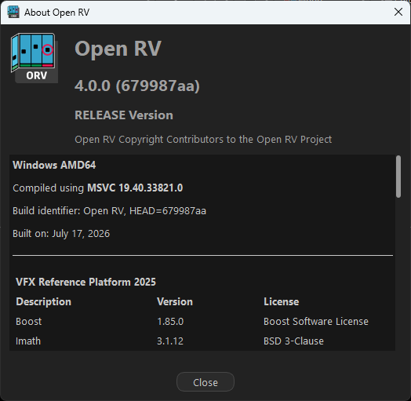

# OpenRV build container
The second container is the actual Windows development and OpenRV build environment.

During creation of this container, the user-provided Qt zip archive (from stage 1) is copied into the Windows image and extracted:

From: `C:\Users\myuser\Desktop\shared\qt-6.5.3-msvc2019_64.zip`

Extracted to:  `C:\Qt\6.5.3\msvc2019_64`

The OpenRV build container can then use that Qt installation along with Visual Studio Build Tools, CMake, Python, MSYS2, and the other required build dependencies.

## Windows first boot
[dockur/windows](https://github.com/dockur/windows) lets you run a script during the last step of the automatic installation.  It must be called `install.bat` and placed in `C:\OEM`. 

In this project, `install.bat` is a wrapper script that calls `install-openrv-cy2025.ps1` which installs the required packages listed on the [Preparing OpenRV on Windows](https://aswf-openrv.readthedocs.io/en/latest/build_system/config_windows.html) page.

- Visual Studio Build Tools
- CMake 3.31.7
- Python 3.11.x
- Strawberry Perl
- Rust
- Git
- MSYS2
- sccache
- Qt (from YOUR zip file)
- jom

The `C:\OEM` directory includes two supporting files which were exported from a Windows Development VM. They list what is needed for MSYS2 and Visual Studio installation:

- `msys2-packages.txt`
- `openrv-cy2025.vsconfig`

## Verify installation
After the container is up and running, connect using RDP and review
`C:\OEM\openrv-cy2025-install.log` for any installation errors before attempting the build.

`bash_profile-example`:  Example of the `.bash_profile` generated by the installation script; use for reference and troubleshooting.

## Build OpenRV
1. Launch `mingw64.exe`
(The environment and path variables were exported to the `.bash_profile` from the `install-openrv-cy2025.ps1` script.)
2. `git clone --recursive https://github.com/AcademySoftwareFoundation/OpenRV.git`
3. cd OpenRV
4. `source rvcmds.sh`
5. `rvcfg -DRV_FFMPEG_NON_FREE_DECODERS_TO_ENABLE="prores;hevc;aac;aac_at;aac_fixed;aac_latm;dnxhd"`
(rvcfg is run before rvbootstrap here to enable the non-free FFmpeg decoders during initial configuration.)
6. `rvbootstrap`
7. `rvinst`

## Next Steps
At this point, the `_install` directory contains the completed OpenRV installation.
Copy the `_install` directory to a Windows machine with graphics hardware and continue with your normal OpenRV testing workflow.

## Example Output

An example of the console output from a successful OpenRV build (truncated) is included in:

`docs/openrv-build-example-output.txt`

Provided as a reference for the general build flow and expected successful completion.

**Example build verification**

After a successful build, the About Open RV dialog should show information similar to the following (build identifier and date will differ):

